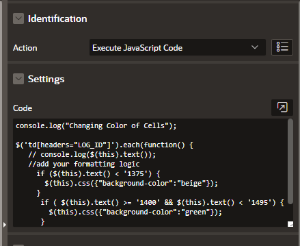

# Example Jquery for customizing a single cell inside a Classic Report

- Create a dynamic action on the classic report. Set the following attributes


- Create a true action of type Execute Javascript Code



- Set the flag to fire on initialization.


- Lets look at the Javascript to format and extract value for evaluation. First here is the sample Jquery to output the data in the cell to the console log. This will loop through each row.

```
console.log("Changing Color of Cells");

$('td[headers="LOG_ID"]').each(function() {
    console.log($(this).text());
});
```
- Next we will add in some Styling Logic. First create a CSS class on the page.
```
.lowTargets{
 background-color: #284e3f;
 font-weight: 600;
 text-align: center;
 color: white;
 border:2px solid #cecece;
}

.midTargets{
 background-color: #16505b;
 font-weight: 800;
 text-align: center;
 color: white;
 border:2px solid #cecece;
}

```
- Save page and add logic to apply to certain cells in Jquery.
```
console.log("Formatting Cells");

$('td[headers="LOG_ID"]').each(function() {
   //add your formatting logic
     if ($(this).text() < '1350') {
       $(this).addClass("lowTargets");
     }
});
```

--
```
console.log("Formatting Cells");

$('td[headers="LOG_ID"]').each(function() {
   // console.log($(this).text());
   //add your formatting logic
     if ($(this).text() < '1375') {
       $(this).addClass("lowTargets");
     }
      if ( $(this).text() >= '1350' && $(this).text() < '1400') {
        $(this).addClass("midTargets");
      }

});
```
