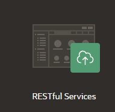
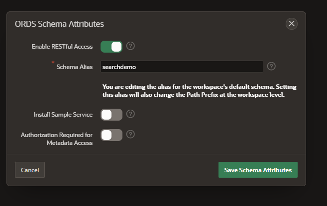
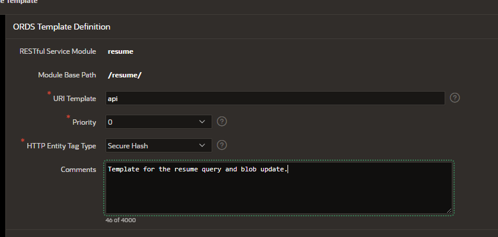
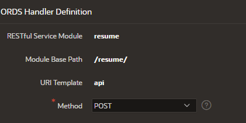
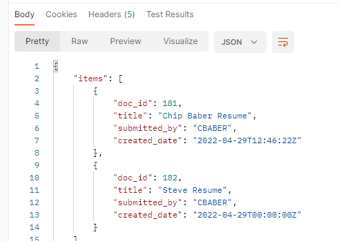
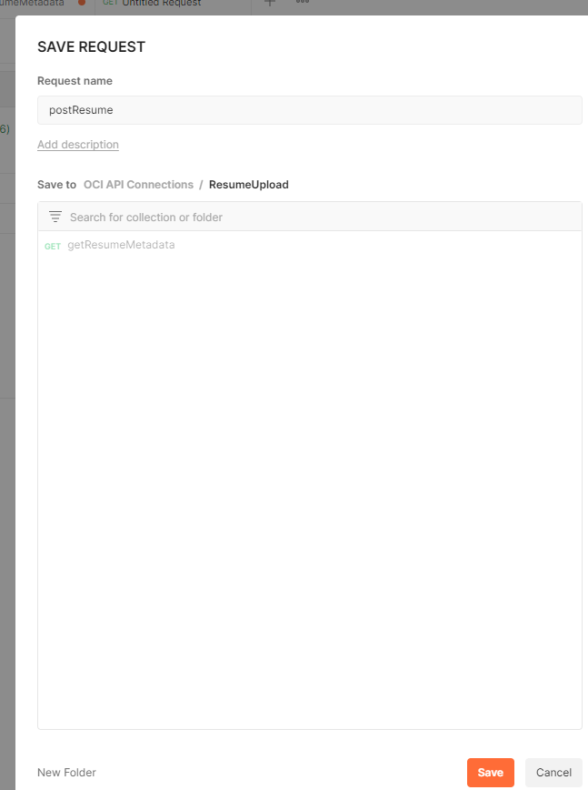
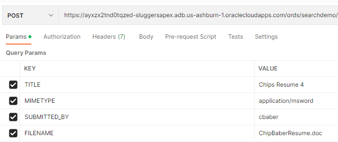
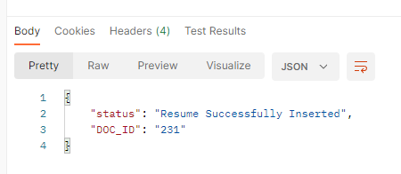

## How to upload a BLOB in ORDS through REST API with parameters.

This how to came at a request from a viewer of the [How to extract text from inside a PDF or Word Doc](https://www.youtube.com/watch?v=AfudCHhAHK4&list=PLsnBif_-5JnA8Hzvp8e1bQ3fo6VEvYEB0&index=10&t=9s). They wanted to know how to upload documents programmatically to the ATP database. In this tutorial we are leveraging a Oracle Free tier account and Oracle APEX 22.14.

- Inside Oracle APEX, navigate to SQL Worksheet.


- Click into Restful Services (ORDS)



- Register your schema with ORDS by clicking the button illustrated below.


- Enable the ORDS Schema defaults with these settings.



- Click on Modules, then create module.


- Set your defaults and create the module.


- Create a template by entering the following fields and pressing Create Template.




- Create a Handler to retrieve the resumes via a get call.


- Enter the following in to create the get rest service. Then press Create Handler.


```
select doc_id, title, submitted_by, created_date from resume
```


- Click on the template and create a second handler.


- Set the method to post.



- Drop in the following mime types to allow Word and PDF resumes to be uploaded.


```
application/pdf, application/msword, application/vnd.openxmlformats-officedocument.wordprocessingml.document

```

- Paste in the Code for the pl/sql procedure.

```
DECLARE
   /*set the variables*/
   resume_id  RESUME.DOC_ID%TYPE;
   created_on RESUME.CREATED_DATE%TYPE;
   v_title RESUME.TITLE%TYPE;
   v_filename RESUME.FILENAME%TYPE;
   v_submitted_by RESUME.SUBMITTED_BY%TYPE;
   v_mimetype RESUME.MIMETYPE%TYPE;
   INVALID_MIMETYPE  EXCEPTION;

   BEGIN
     v_title := :TITLE;
     v_filename := :FILENAME;
     v_submitted_by := :SUBMITTED_BY;
     v_mimetype := :MIMETYPE;

   IF LTRIM(RTRIM(LOWER(v_mimetype))) NOT IN ('application/pdf','application/msword','application/vnd.openxmlformats-officedocument.wordprocessingml.document')
       THEN
       RAISE INVALID_MIMETYPE;    
     END IF;

     IF v_title IS NULL OR v_filename IS NULL OR v_submitted_by IS NULL OR v_mimetype IS NULL
       THEN
           RAISE NO_DATA_FOUND;
       ELSE

    /*Get the insert date*/
     select sysdate into created_on from dual;

     /*Insert the BLOB and return the trigger generated doc_id*/
     INSERT INTO resume (TITLE, FILENAME, SUBMITTED_BY, RESUME, MIMETYPE, CREATED_DATE) VALUES (:TITLE, :FILENAME, :SUBMITTED_BY, :BODY, :MIMETYPE, created_on) RETURNING DOC_ID INTO resume_id;

     owa_util.status_line(201, '', false);
     owa_util.mime_header('application/json', true);
     htp.prn('{"status": "Resume Successfully Inserted","DOC_ID":"'||resume_id||'"}');
     END IF;

     EXCEPTION
           WHEN INVALID_MIMETYPE THEN
            owa_util.status_line(411, 'Invalid MIME TYPE', false);
            owa_util.mime_header('application/json', true);
            htp.prn('{"status": "Invalid MIME Type Uploaded","MIME Type not in accepted list for resumes."}');

           WHEN NO_DATA_FOUND THEN
                 owa_util.status_line(411, 'Null Parameter Error', false);
                 owa_util.mime_header('application/json', true);
                 htp.prn('{"status": "Null Parameter Error","One or more required parameter values is missing. TITLE, FILENAME, SUBMITTED_BY, RESUME and MIMETYPE are all required to complete the post."}');
           WHEN OTHERS
           THEN
                 owa_util.status_line(411, 'Unknown Exception Error', false);
                 owa_util.mime_header('application/json', true);
                 htp.prn('{"status": "Unknown Exception Error","Something went wrong in the code, here is the sqlerr response:"'||SQLERRM||'}');
   END;
```

- Create the Handler.


- To test these API's we will configure postman. [Postman Main Page](https://www.postman.com/). Inside postman create a new collection buy clicking the + sign and entering a name.


- Inside your collection add a new request and name it getResumeMetadata.


- Go back into ORDS and copy the full url.


- Paste the url into postman and press send.


- Review the results from the database.



- Create a new request in postman to upload the document by pressing the + sign, clicking save and naming the new request.




- Set the type to post and paste in the full url from ORDS.


- Look at the values section of your insert statement, the textual items you need to pass in to insert with the BLOB. In our example, Title, Filename, submitted_by and mimetype are required for the insert.


- In postman create a parameter for each of these items and insert default values for your test.



- Click on the body tab and set to binary. Select your resume file. The binary file will map to your pl/sql through the :body bind variable. 


- Save your work in postman and press send. Review the body response in postman.



- Navigate in APEX to SQL Workshop and run the following query to confirm the file and metadata were inserted.


- Optional: To troubleshoot sometimes Code to loop through the headers and output the header + value.

```
for i in 1..nvl(owa.num_cgi_vars, 0) loop
      htp.p(owa.cgi_var_name(i) || ' : ' || owa.cgi_var_val(i));
      htp.p(' ');
end loop;
```
